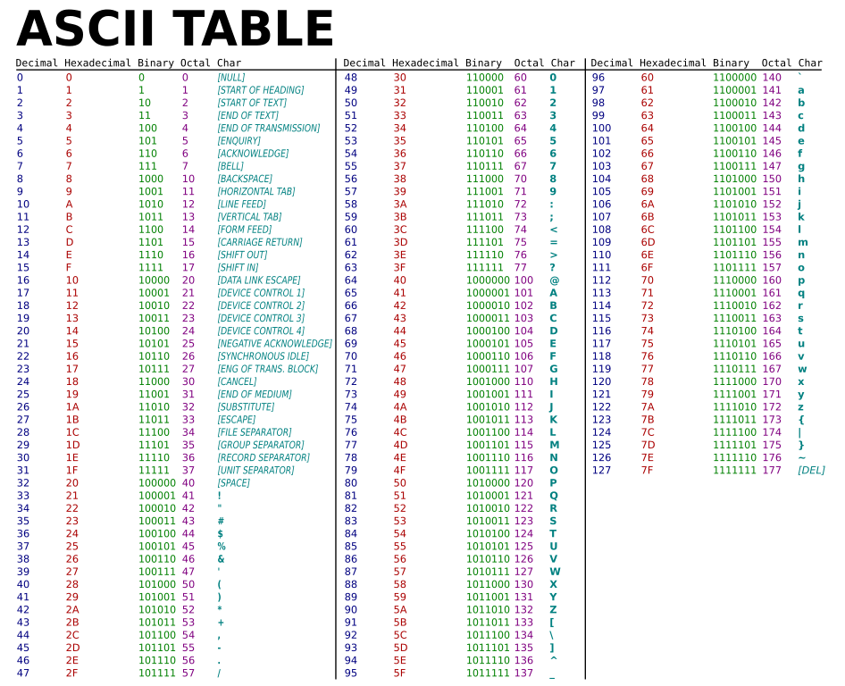

Programming assignment 6 (PA06)
==============================

## Assignment Description
Help Tank find Morpheus and the others in The Matrix by creating a dictionary to automate the deciphering of known symbols in code!

Real world matrix: Why does sorting characters work in a BST? What would the binary encoding of your text file look like?

Your tasks are:

1. to write the MyMap functions

2. to write a function, get_letter_frequency(), that accepts an
arbitrary number of characters from standard input and builds a MyMap containing the
number of occurrences for each character in the input, i.e., if the letter 'a' occurs
43 times in the input, map['a'] should return 43.
An example of the behavior of this function is at the end of pa06.cpp, which expects \<sample_input.txt

## Assignment Notes
You will implement a dictionary (abstract data type) using a binary search tree
data structure that will have similar functionality to std::map.

https://en.cppreference.com/w/cpp/container/map

Deliverable: You must submit a file, `MyMap.hpp`, that contains the implementations of
1. all of your MyMap functions and
2. get_letter_frequency()
3. your name function

For those in the data structures lab, check out the unit testing framework at
https://git.mst.edu/taylorpat/simple_cpp_test

The files listed here are the starting point for your assignment.
Only add source files (not compiled files) to the Git repository.

Remember, the assignment due date is posted on the course website.

## Note (actuall do this)!!
Thoroughly read the Canvas page **How to: Homework Submissions** for good tips, tricks, hints, and instructions on programming assignments, including how to submit via Git.
