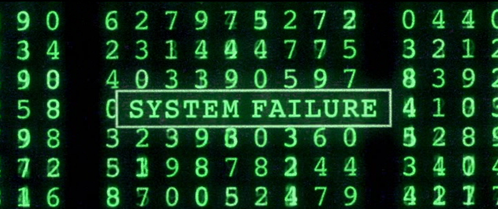

Programming assignment 8 (PA08)
==============================

Congratulations on making it this far -- the semester is almost over!

The files listed here are the starting point for your assignment.
Only add source files (not compiled files) to the Git repository.

**Help Tank identify the amount of viruses in code!**



Your tasks are:

1. to write the *MyUnorderedMap* functions

2. to write a function, get_virus_frequency(), that accepts an
arbitrary number of lines from standard input and builds a MyUnorderedMap containing *the
number of occurances* for every word containing the word "Virus" in it, i.e., if the word
"CryptoLockerVirus" appears 15 times in the input code, then map["CryptoLockerVirus"] should return 15.
An example of the behavior of this function is at the end of pa06.cpp, which expects \<sample_input.txt


```cpp
// Some actual C++ source code (your sample_input.cpp)
// the substring reallyBig_badvirus37 should be extracted

cout <<reallyBig_badvirus37()<< endl;
```

```cpp
// your actual get_virus_frequency code:

myhashdictionary["reallyBig_badvirus37"] = 1;

myhashdictionary["reallyBig_badvirus37"]++;
```

```sh
# This is how you'd run

g++ pa08.cpp

./a.out <sample_input.txt
```

Hint: you can't just define word boundaries by spaces, because this is code.
You will need to define word boundaries by special characters too. For example, how would you extract *reallyBig_badvirus37* from *\<<reallyBig_badvirus37()<<*?

## Assignment Notes
You will implement a dictionary (abstract data type) using a **hash table**
data structure that will have similar functionality to std::unordered_map.

https://en.cppreference.com/w/cpp/container/unordered_map

Deliverable: You must submit a file, `MyUnorderedMap.hpp`, that contains the implementations of
1. all of your MyUnorderedMap functions and
2. get_virus_frequency()
3. your name function

Remember, the assignment due date is posted on the course website.

Thoroughly read the Canvas page **How to: Homework Submissions** for good tips, tricks, hints, and instructions on programming assignments, including how to submit via Git.
