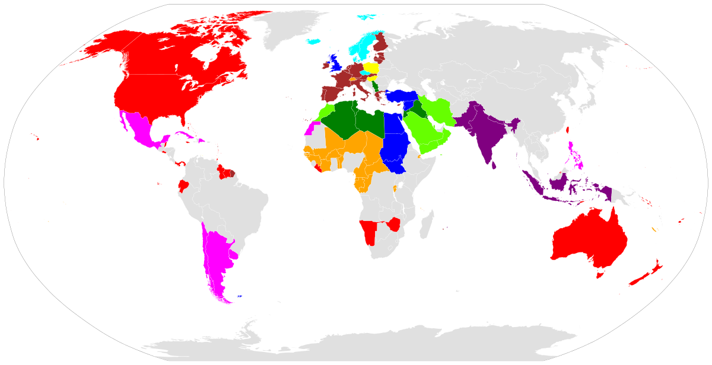
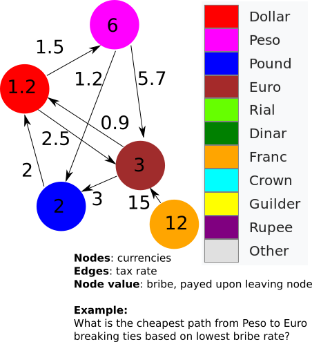

Programming assignment 9 (PA09) - Final Project
==============================

# Shortest paths and currency exchange

## The World's currencies (a small subset):

Color key below

## Problem: Move your money

* Your goal is to move your money, minimizing losses to taxes (edges) and bribes (nodes).
* In choosing a path, choose the **lowest cost** (shortest path) primarily based on edge-weight, and only **secondarily** breaking ties by bribe rate if there are two equivalent shortest paths.

## You are required to edit 4 files and their dependencies:
* `MyGraph.h` (make sure you spell this and all functions correctly);
fully implement all functions in this file.
It is easier to just define your functions in the h file.
* `import_problem.cpp`
* `import_graph.cpp`
* `dijkstra.cpp`
* You can submit other hpp or h files, though you are not required to do so.
* Note: don't rely on cpp files other than those listed being compiled (they will not be).
* Make sure to include any header files you use (e.g., heap.h) in the repository!

## Input and output files
* Input will be via cin / standard input (as before).
* Output will be via cout / standard output (as before).

### Input files
* We give you three examples of weighted directed graphs.
* The file format is csv (comma separated value) file containing a matrix of exchange rates, with row and column headers as node-names and bribe costs (in parentheses).
* **Open this file in LibreOffice or MS-Excel**;
csv is the original spreadsheet. The first thing for you to do is read up on the csv format, and make sure you understand it!
* The matrix file also has a question at the end.
You must parse this to determine the desired path to be printed.
* Note: the number of commas is significant. Make sure you understand the file format.
* Left row indices are "from" and top column headers are "to" in the graph.

### Output files
* Example given.
* You will need to add/remove plurality with currency names, including new ones that we test with.
* We will not test with all real-world currency names (they will all be single-word names with no spaces)
* Make sure formatting matches; use methods below:
* Make sure to round edge and bribe cost numbers the same as we do in the example outputs, to one decimal, for example:
    * 2.0 becomes 2.0
    * 2.222 becomes 2.2
    * 3.01 becomes 3.0
    * 33.96 becomes 34.0
    * 3.64 becomes 3.6
    * 3.67 becomes 3.7

## Running
`$ g++ anymain.cpp (e.g., pa09.cpp) dijkstra.cpp import_problem.cpp import_graph.cpp -std=c++11`

`$ ./a.out <sample_input.csv >your_output.txt`

`$ diff your_output.txt sample_output.txt`

Note: We will not be running with g++ *.cpp, so don't use another cpp file.
Name your files and functions correctly!

## Grading
* Create some graphs of your own to test bigger input sets.
* Write some unit tests of your own!
* There is no speed component
* You **must** use Dijkstra's algorithm with a priority queue.
* Despite the fact that this is a popular algoritm, and versions of it can be found online, don't copy that code!
* You can (and are encouraged) to use http://en.cppreference.com/w/cpp/container/priority_queue or any other std:: containers you like.
* With this open-ended format, fully detailed unit testing will not be possible.
You will be graded on your output, and the use of correct code and specified algorithms.
* We will test with other currencies (random single-word names), and the graph may be arbitrarily large.
* Test with more graphs than just those we give you!!
* Not all nodes will be reachable, and you will need to report that when it occurs with your destination (see demo sample_input and sample_output files).

# General notes
The files listed here are the starting point for your assignment.
Only add source files (not compiled files) to the Git repository.

Remember, the assignment due date is posted on the course website.

Thoroughly read the Canvas page **How to: Homework Submissions** for good tips, tricks, hints, and instructions on programming assignments, including how to submit via Git.

# Timing
This is your last project! Congratulations for being almost through data structures. *There will not be re-grades.* So if you want to make sure to get any questions answered, plan accordingly with us, instructors and TAs.
